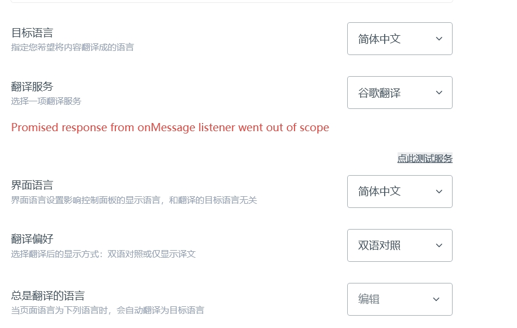

# 자주 묻는 질문

## 위챗 로그인 문제

### 1. 모바일에서 위챗 로그인을 어떻게 사용하나요?

죄송합니다. 현재 위챗 로그인 기능은 PC 에서만 지원됩니다.

### 2. PC 에서 위챗으로 계정을 등록했는데, 모바일에서는 어떻게 로그인하나요?

1. 이메일로 새로운 Immersive Translate 계정을 [등록](https://immersivetranslate.com/accounts/login)하세요
2. 새 계정으로 로그인한 후 [개인 센터](https://immersivetranslate.com/profile)에서 통합 메뉴를 통해 위챗 계정을 연동하면 멤버십 혜택이 새 계정으로 동기화됩니다


## 보안 관련

### 1. Android 앱에서 플로팅 볼이 사라졌습니다

이전 버전의 애드온이 비활성화되었기 때문입니다.

앱을 삭제한 후 [공식 웹사이트](https://immersivetranslate.com/)에서 최신 버전을 설치해 주세요.

## 설치 관련

### 1. 확장 프로그램 업데이트 방법

일반적으로 브라우저 스토어에서 설치한 확장 프로그램은 새 버전이 출시된 후 하루 이내에 자동으로 업데이트됩니다. 최신 버전으로 즉시 업데이트하려면 브라우저의 **확장 프로그램 관리** 페이지에서 **개발자 모드**를 켠 다음 상단의 **업데이트**를 클릭하면 스토어의 최신 버전으로 즉시 업데이트할 수 있습니다.


### 2. Immersive Translate 유저스크립트가 지원하는 브라우저

iOS 시스템:

- [Tampermonkey 브라우저](https://www.tampermonkey.net/)
- 유저스크립트 확장 프로그램이 설치된 Safari 브라우저, 설치 가능한 유저스크립트 확장 프로그램:
  - [Userscripts](https://itunes.apple.com/us/app/userscripts/id1463298887)
  - [Stay](https://apps.apple.com/cn/app/stay-safari%E6%B5%8F%E8%A7%88%E5%99%A8%E4%BC%B4%E4%BE%A3/id1591620171): Stay 내장 스토어에서 Immersive Translate 최적화 스크립트를 검색하여 다운로드하는 것을 권장합니다 (Stay 에 맞게 특별히 최적화됨).

Android 시스템:

- [Firefox 최신 버전](https://www.firefox.com.cn/download/#product-android-release): 설치 후 [Tamper Monkey](https://www.tampermonkey.net/) 확장 프로그램을 설치하세요.
- [X 브라우저](https://www.xbext.com/?ref=immersive-translate): 설치 후 [Immersive Translate 유저스크립트 주소](https://download.immersivetranslate.com/immersive-translate.user.js)를 직접 열어 설치할 수 있습니다.

유저스크립트 확장 프로그램을 지원하지 않는 브라우저 (필수 유저스크립트 API 가 부족함):

- Android Via 브라우저
- iOS Alook 브라우저

### 3. Chrome 에서 플러그인 설치 패키지 오류 발생

`invalid value for web_accessible_resource[0]` 오류 메시지가 표시되는 경우

manifest_version 3 을 지원하려면 Chromium 버전이 88 이상이어야 합니다.

### 4. 360 브라우저 설치 방법

Immersive Translate 플러그인은 **360 극속 브라우저 x** (제품명에 x 가 포함됨) 만 지원합니다.

Google Chrome 확장 프로그램 스토어에서 플러그인을 설치하거나 [수동 설치](/docs/installation/#%E6%89%8B%E5%8A%A8%E5%AE%89%E8%A3%85-%E8%BF%BD%E8%B8%AA%E6%9C%80%E6%96%B0%E5%BC%80%E5%8F%91%E7%89%B9%E6%80%A7)할 수 있습니다.

### 5. Opera 브라우저에서 작동하지 않음

google.com 등 검색 페이지에서 플러그인이 작동하지 않고 `현재 페이지를 새로고침한 후 번역을 시작해 주세요`라는 메시지가 표시되며 새로고침 후에도 동일한 메시지가 표시되는 경우, Opera 플러그인 설정에서【Immersive Translate】를 찾아【검색 페이지 결과 접근 허용】옵션을 활성화해야 합니다.

-UqvTUexInGVTf3X2.png>)

### 6. iOS 기기에서 확장 프로그램을 활성화할 수 없음

iOS 기기에서 확장 프로그램을 활성화할 수 없는 경우 다음 단계를 따르세요:

1. 【설정】앱을 엽니다
2. 스크롤하여【스크린 타임】을 탭합니다
3. 【콘텐츠 및 개인정보 보호 제한】을 선택합니다
4. 【콘텐츠 제한】으로 들어갑니다
5. 【웹 콘텐츠】를 선택하고【무제한】으로 설정합니다

콘텐츠 및 개인정보 보호 제한의 다른 기능이 필요하지 않은 경우 콘텐츠 및 개인정보 보호 제한을 직접 비활성화할 수도 있습니다:

1. 【설정】앱을 엽니다
2. 【스크린 타임】을 선택합니다
3. 【콘텐츠 및 개인정보 보호 제한】을 비활성화합니다

### 7. Safari 에서 설정 페이지가 계속 로딩 중으로 표시됨

Safari 브라우저 -> 설정 -> 웹사이트 -> Immersive Translate -> immersivetranslate.com 관련 도메인을 찾아 삭제합니다.

-O7IPyq2aF6WhbgMO.png>)

### 8. iPhone 이 iOS 18 로 업데이트 후 설정 페이지 로그인 시 빈 페이지로 이동

플로팅 볼을 길게 누르고 프로필 아이콘을 탭하여 계정에 로그인하세요.

### 9. 다운로드한 오프라인 플러그인 파일을 브라우저 확장 프로그램으로 드래그했는데 파일이 존재하지 않는다고 표시됨

압축 파일을 먼저 압축 해제한 다음 `.CRX` 파일만 별도로 드래그해야 합니다.

### 10. crx 다운로드 후 설치 버전이 최신 버전이 아닌 1.13.5 인 이유

시스템이 브라우저의 Chromium 커널 버전이 115 미만임을 감지하여 플러그인의 일부 고급 기능을 지원하지 않으므로 자동으로 1.13.5 버전으로 다운그레이드됩니다.

## 기본 번역 관련

### 1. 웹페이지 번역, 페이지 주요 영역 번역, 페이지 전체 영역 번역의 차이점은 무엇인가요?

**웹페이지 번역 (기본 옵션)**

이 옵션은 실제로 "페이지의 주요 영역 번역"을 의미합니다.

- **무슨 의미인가요?** 대부분의 웹사이트의 원본 레이아웃과 내비게이션 기능을 보호하기 위해 Immersive Translate 는 웹페이지의 핵심 콘텐츠 영역 (예: 기사 본문, 게시물 내용 등) 을 지능적으로 식별하여 번역합니다.

- **왜 이렇게 하나요?** 웹사이트의 내비게이션 바, 헤더/푸터 또는 일부 특수 요소 (예: Twitter 의 사용자 이름, 게시 시간) 가 번역되면 페이지의 미관을 해칠 뿐만 아니라 웹사이트의 정상적인 사용에도 영향을 줄 수 있습니다. 따라서 많은 주요 웹사이트에 대해 세밀한 적응 작업을 수행하여 이러한 비핵심 부분을 번역에서 제외했습니다.

- **추가 설명:** 이 규칙은 100% 완벽하지 않습니다. 일부 초기 또는 소규모 웹사이트는 적응되지 않았을 수 있으므로 기본 모드에서도 내비게이션 바 등의 영역이 번역될 수 있습니다. 지속적으로 최적화하고 있습니다.

**페이지 전체 영역 번역**

말 그대로, 이 옵션을 선택하면 플러그인이 페이지의 모든 인식 가능한 텍스트를 구분 없이 번역합니다. 이전에 제외되었던 내비게이션 바, 사이드바 등 모든 요소가 번역 대상이 됩니다.

**적용 시나리오**

- **일상적인 사용:** 기본 "웹페이지 번역" 옵션을 유지하는 것이 좋습니다. 번역 효과를 보장하면서 최상의 웹 브라우징 경험을 제공합니다.
- **특수한 경우:** 필요한 사이드바나 다른 영역의 콘텐츠가 번역되지 않았고 해당 번역이 실제로 필요한 경우 임시 해결책으로 "페이지 전체 영역 번역"으로 수동 전환할 수 있습니다.


### 2. Youtube, Facebook 등 웹사이트에서 주요 콘텐츠는 번역되었지만 일부 사이드바가 번역되지 않아 전체를 번역하고 싶은 경우

페이지 가독성과 경험을 고려하여 Immersive Translate 는 기본적으로 주요 콘텐츠 영역만 번역합니다.

전체 영역을 번역하려면 플러그인 패널을 열고 (모바일에서는 플로팅 볼을 길게 누름) -> 오른쪽 하단의 **더보기**를 클릭 -> **「전체 영역 번역으로 전환」**을 선택합니다.

-p0X8p6YHUUIy7A-K.png>)

### 2. 모바일 앱에서 플로팅 볼이 표시되지 않음

- Immersive Translate 플러그인은 브라우저 플러그인으로 **브라우저에서만** 실행되며 다른 앱에서는 사용할 수 없고 다른 앱 내부 번역을 지원하지 않습니다.

- 브라우저와 설치된 플러그인은 일대일로 대응하며 **브라우저 간 사용이 불가능**합니다 (예: Safari 에 설치된 플러그인을 Chrome 에서 사용할 수 없음)

### 3. iOS 브라우저에서 YouTube 링크를 클릭하면 앱이 바로 열려 웹페이지 번역을 할 수 없음

YouTube 링크를 길게 눌러 팝업 창에서 웹페이지로 열기를 선택하세요.

### 4. 자동 번역 끄는 방법

- 팝업 패널 또는 설정 페이지에서 취소합니다.

- 또는 설정 페이지를 통해 수정합니다

-27sbOakCfjAGn1E0.png>)

### 5. 현재 페이지를 번역할 권한이 없음

- 브라우저 기본 페이지는 번역할 수 없습니다 (주소 표시줄에 주소 없음)
- 타사 플러그인 페이지는 번역할 수 없습니다
- Google 플러그인은 Google 스토어 페이지 번역을 금지합니다

### 6. 원문을 표시하지 않는 방법

Immersive Translate 아이콘을 클릭하여 확장 패널을 열고【더보기】를 클릭한 다음【번역문만 표시 모드로 전환】을 선택합니다. 비디오 데모를 참조하세요:

<div style={{textAlign: "center"}}>
  <video
    controls
    muted
    style={{width:"100%", maxWidth:500}}
    poster="https://s.immersivetranslate.com/assets/r2-uploads/004_切换双语-封面-AHSpIxvmD713B8sh.jpg"
    src="https://s.immersivetranslate.com/assets/r2-uploads/004_切换双语-EKS6H03tEOg-EhDt.mp4">
  </video>
</div>

### 7. 페이지에 느낌표가 표시됨

페이지에 느낌표가 표시되면 번역 서비스에 문제가 발생하여 오류가 반환된 것입니다. 느낌표 위에 마우스를 올려 구체적인 오류를 확인할 수 있습니다.

#### 예: 429 오류

가장 흔한 오류 중 하나입니다. 429 는 요청 빈도가 너무 빠르다는 것을 나타냅니다. 웹페이지 번역에는 많은 단락을 번역해야 하며, 최대한 최적화했지만 일부 번역 서비스가 과부하되어 429 빈도 제한 오류를 반환하는 경우가 있습니다.

이 문제는 일반적으로 다른 번역 서비스로 일시적으로 전환하거나 나중에 다시 시도하면 해결할 수 있습니다.

Google 서비스 사용 시 429 오류가 발생하면 일반적으로 Google 이 사용 중인 노드에 대해 속도 제한을 적용한 것이므로 노드를 변경하는 것이 좋습니다.

### 8. 번역 소스와 대상 언어 전환 방법

모바일: 플로팅 볼을 길게 누릅니다.

PC: 마우스를 플로팅 볼로 이동하여 설정을 불러옵니다.

다른 번역 서비스/다른 대상 언어를 선택합니다.


### 9. Google 번역 API 차단 문제

`translate.googleapis.com` 도메인을 프록시 규칙에 추가해 주세요.

### 10. OpenAI 의 중국 지역 API Key 차단이 회원의 AI 서비스 사용에 영향을 미치나요

영향이 없습니다. 제품은 Azure 엔터프라이즈 버전 OpenAI 를 사용하므로 API 지역 제한을 받지 않습니다.

### 11. 彩云翻译 오류

`?` 표시의 오류 메시지를 클릭하면 "Unsupported trans_type"이 표시됩니다. 자동 감지 언어를 수동으로 특정 언어로 선택할 수 있습니다.

### 12. 微信读书를 번역할 수 없음

微信读书는 콘텐츠에 대해 특수 처리를 하여 타사 수단을 통한 콘텐츠 획득을 금지하므로 번역할 수 없습니다.

### 13. 웹페이지 일부 콘텐츠가 번역되지 않음

일반적으로 웹사이트 관리자가 `translate="no"` 또는 `notranslate class`를 통해 번역 플러그인이 해당 영역을 번역하지 않도록 지정한 것입니다.

다음 방법으로 해결할 수 있습니다:

1. 마우스 호버 기능 활성화
2. 마우스 호버를 통해 해당 영역의 단락 콘텐츠를 강제 번역

-_JbXNlBLSe-tVmjt.png>)

### 14. 번역 트리거가 작동하지 않음

특정 웹사이트에서 번역이 안 되지만 다른 웹페이지는 정상적으로 번역되는 경우

- 방문자가 적은 웹사이트인 경우

  - 마우스 호버를 통해 단락을 번역하는 것이 좋습니다
  - 전체 웹사이트를 번역해야 하는 경우 [사용자 규칙](/docs/advanced/#用户规则合并增强)을 통해 적응할 수 있습니다

- 많은 사람이 사용하는 웹사이트인 경우
  - 먼저 마우스 호버 번역으로 사용할 수 있습니다
  - 사용자 그룹에 오류를 보고하면 기술팀이 나중에 적응 작업을 진행합니다

### 15. 웹페이지 번역에 문제가 있을 때 피드백을 위해 웹페이지를 저장하는 방법

웹페이지에서 마우스 오른쪽 버튼을 클릭하여 "다른 이름으로 저장"을 선택하거나 ctrl+s 단축키를 사용하고, 저장 옵션에서 단일 파일을 선택하면 파일 형식이 .mht/.mhtml이 됩니다. 그런 다음 파일을 support@immersivetranslate.com 으로 보내주세요.

-z1OWfJqCqHri1mFp.png>)

### 16. 디버그 로그 확인

1. 디버그 로그 활성화: 패널 열기 -> 설정 -> 개발자 설정 -> "콘솔에 디버그 로그 출력" 활성화.
2. 웹사이트의 콘솔 열기: 마우스 오른쪽 버튼으로 검사 열기 -> 오른쪽 패널 상단에서 콘솔로 전환 -> 작업을 수행하면 로그를 볼 수 있습니다.

### 17. 플로팅 볼 끄는 방법

- 현재 페이지에서 숨기기: 【이 웹사이트 번역 안 함】으로 설정하면 됩니다
- 모든 페이지에서 숨기기: 【설정】-【플로팅 볼】을 열고【플로팅 볼 활성화】를 끕니다

-mBXqJ4yCmbSbpzcz.png>)

### 18. 마우스 호버 + 단축키 번역 기능이 작동하지 않음

마우스 호버와 단축키를 함께 사용하는 번역 기능을 활성화하려면 페이지가 먼저 포커스를 받아야 합니다. 기능이 트리거되지 않는 경우 다음 단계를 시도해 보세요:

1. 페이지의 **아무 곳이나 한 번 클릭**하여 페이지가 포커스를 받도록 합니다.
2. 마우스 호버와 단축키를 동시에 사용하여 다시 번역을 시도합니다.
3. 번역 기능이 여전히 응답하지 않으면 **단축키 설정이 올바른지 확인**해 주세요.

### 19. 최신 규칙 업데이트 방법

확장 프로그램은 사용 중에 정기적으로 공식 최신 웹페이지 적응 규칙을 자동으로 동기화합니다.

수동으로 동기화하려면 브라우저에서 Immersive Translate 확장 아이콘을 클릭하세요. 플러그인 카드가 열리면 확장 프로그램이 자동으로 최신 적응 규칙을 감지하고 업데이트합니다.

유저스크립트 사용자도 규칙의 자동 감지 및 동기화를 지원합니다.

### 20. 번역 실패 / 번역 활동 표시기가 계속 돌아감

1. 실패 원인 확인:

   - **할당량 한도 도달**인 경우, 해당 월의 번역 소스 할당량이 소진된 것입니다
   - 네트워크 오류가 표시되면 먼저 노드/네트워크 상태를 확인하세요

2. 번역 서비스 전환, 플로팅 볼을 길게 누르거나 플러그인 아이콘을 클릭하여 팝업 패널에서 다른 번역 서비스를 선택합니다.

### 21. Pro 회원 번역 할당량 및 사용량 확인 방법

- Pro 회원은 매월 2,000 만 토큰의 기본 번역 할당량을 사용할 수 있습니다. 이 할당량은 모든 번역 서비스에 사용할 수 있으며, 전부 DeepL 에 사용하든 (2,000 만 문자에 해당), 전부 OpenAI 에 사용하든 (2,000 만 토큰), 여러 서비스를 혼합하여 사용하든 실제 필요에 따라 자유롭게 할당량을 배분할 수 있습니다

  > OpenAI 의 가격은 토큰 기반입니다. 영어 텍스트의 경우 1 토큰은 약 4 자 또는 0.75 단어입니다. 일반적으로 1,000 토큰은 약 750 개의 영어 단어 또는 400~500 개의 한자에 해당합니다.

- 사용량 확인 주소: [https://immersivetranslate.com/accounts/usage](https://immersivetranslate.com/accounts/usage)

### 22. 플러그인의 Google 번역 품질이 Google 웹페이지 번역보다 낮은 이유

현재 확장 프로그램은 Google 번역의 무료 API 를 사용하고 있으며, 이 인터페이스는 Google 이 초기에 제공한 구버전 서비스로 더 이상 지속적으로 유지 관리되지 않습니다. 반면 Google 공식 웹사이트의 번역 기능은 계속 최적화되고 있으므로 이론적으로 번역 품질이 더 높습니다.

최근 Google 무료 API 의 번역 품질이 현저히 저하되어 다른 사용 가능한 번역 서비스로 전환하는 것을 권장합니다. 동시에 더 나은 대안을 적극적으로 평가하고 찾고 있습니다.

더 많은 토론 내용 보기: [#2574](https://github.com/immersive-translate/immersive-translate/issues/2547)

### 23. 마우스 모드인데 터치 모드로 표시됨

[고급 설정](https://dash.immersivetranslate.com/#advanced)에서 마우스 전용 모드를 활성화하면 됩니다.

1.14.9 버전에서 이 모드 판단이 최적화되었습니다.

### 24. Edge 에서 번역문을 읽어주지 않음

Edge 브라우저의 읽기 기능은 원본 웹페이지의 언어에 따라 해당 음성 모델을 자동으로 선택합니다. 이러한 음성 모델은 단일 언어용으로 설계되어 있어 페이지에 번역문이 포함되어 있을 때 기본으로 선택된 음성 모델이 번역문 내용을 올바르게 읽을 수 없습니다.

해결 방법: Edge 읽기 기능의 도구 모음에서【음성 옵션】을 클릭한 다음 번역문 언어와 일치하는 음성 모델을 수동으로 선택합니다. 그러면 번역문 내용을 올바르게 읽을 수 있습니다.

### 25. Arc 브라우저에서 단축키가 작동하지 않음

Arc 브라우저 자체 버그로 인해 브라우저 확장 프로그램의 단축키가 작동하지 않을 수 있습니다.

해결 방법: 단축키 설정 페이지에서 단축키 범위를 "Chromium 에서"에서 "전역"으로 변경합니다.


참고: 전역으로 설정한 후에는 브라우저 창이 포커스에 없어도 트리거될 수 있습니다.
즉, 다른 소프트웨어에서 번역 단축키를 눌러도 웹페이지의 번역이 트리거될 수 있어 다른 소프트웨어의 단축키와 충돌할 수 있습니다.

권장: Arc 브라우저에서는 플로팅 볼로 번역하거나 Chrome 브라우저에서 단축키를 사용하세요.

## 비디오 번역 관련

### 1. Youtube 자막 스타일 설정

Youtube 자체 자막 설정에서 [Options]를 클릭하면 크기, 색상 등을 조정할 수 있습니다.


### 2. YouTube 이중 자막 번체 중국어가 표시되지 않음

YouTube 자체 기계 번역 자막에서 번체 중국어는 형식 오류가 발생하여 모든 자막이 시작할 때 한꺼번에 표시됩니다. 이 시나리오에서는【설정】【비디오 자막】에서【Immersive Translate 로 자막 번역 사용】옵션을 활성화하는 것이 좋습니다.

### 3. Bilibili 에서 자막 번역 활성화 방법

Bilibili 비디오 자막을 번역할 때 다음 단계를 따르세요:

1. 먼저 Bilibili 내장 자막을 활성화합니다. 플레이어 오른쪽 하단의 "자막" 버튼을 클릭하면 됩니다. 비디오에 자막 버튼이나 자막 내용이 없으면 이중 자막을 지원하지 않습니다.
2. 플레이어의 "Immersive Translate" 아이콘을 클릭하여 이중 자막 기능을 활성화합니다.

사용 시 주의사항:

1. Bilibili 의 내장 자막이 활성화되어 있는지 확인하세요.
2. Immersive Translate 의 대상 언어가 Bilibili 내장 자막의 언어와 다른지 확인하세요. 그래야 번역 기능이 트리거됩니다.

### 4. Netflix 자막 번역에서 원본 자막 스타일 사용

- 현재 Netflix 는 점진적 번역 방식을 채택하여 자막 스타일을 자체 호스팅하며 수동 자막을 지원하지 않습니다.
- 이전 방식은 모든 자막 번역이 완료될 때까지 기다려야 자막이 표시되며 수동 자막을 지원합니다.

**이전 방식으로 되돌리는 방법**

【[개발자 설정](https://dash.immersivetranslate.com/#developer)】에 들어가서 `Edit User Rules`를 찾습니다
다음 규칙을 추가합니다

```json
[
  {
    "id": "netflix",
    "subtitleRule.add": {
      "attachRule": {
        "appendSelector": ""
      }
    }
  }
]
```

## 파일 번역 관련

### 1. 로컬 파일 번역 방법

- 방법 1: [Immersive Translate - 문서 번역](https://app.immersivetranslate.com/)에 접속합니다. Immersive Translate 확장 아이콘을 클릭하고【파일 번역】을 클릭하여 접속할 수도 있습니다.

- 방법 2: Chrome 계열 브라우저 (Chrome, Arc, Edge 브라우저) 를 사용하는 경우 다른 방법이 있습니다. 브라우저에서 확장 프로그램 관리 페이지 `chrome://extensions`를 열고【Immersive Translate】플러그인을 찾아【로컬 파일에 대한 액세스 허용】을 활성화하면 브라우저에서 로컬 HTML 또는 로컬 PDF 파일을 직접 열어 마우스 오른쪽 버튼으로【번역】할 수 있습니다.


Edge 브라우저는 다음 방법을 참조하세요——


**참고**: Safari 브라우저와 Firefox 브라우저는 확장 프로그램의 로컬 파일 액세스에 엄격한 제한이 있으므로 Safari 및 Firefox 사용자는 [Immersive Translate - 문서 번역](https://app.immersivetranslate.com/)에서 로컬 파일을 번역하세요.

### 2. 페이지 수가 많을 때 PDF 파일 번역이 느림

100 페이지 이하의 여러 부분으로 분할한 후 번역하고 번역이 완료되면 병합하는 것이 좋습니다

### 3. PDF 번역문이 중복되거나 겹침

소스 파일 자체의 인식 문제로 인해 발생합니다. 해당 부분을 수동으로 클릭하여 불필요한 텍스트 상자를 삭제하는 것이 좋습니다. PDF 번역 효과를 지속적으로 최적화하고 있습니다.

### 4. 용어집이 있나요 / 특정 단어를 특별하게 번역하거나 번역하지 않을 수 있나요

1.16.1+ 버전에서 [AI 용어집](https://dash.immersivetranslate.com/#terms) 기능을 지원합니다.

AI 용어집은 기본적으로 Google/Microsoft와 같은 기계 번역 용어를 지원하지 않습니다

기계 번역 모델은 플레이스홀더 대체를 사용하므로 용어집을 사용하면 번역 품질이 저하될 수 있습니다.

강제 활성화 방법:

【[개발자 설정](https://dash.immersivetranslate.com/#developer)】 -> 【Edit Full User Config】

```
{
  ....
  "enableMachineTranslateTerms":true,
  ...
}
```

### 5. Word 파일 번역 후 Word 형식으로 내보낼 수 없음

현재 Word 파일 내보내기에 일부 기술적 문제가 있으므로 현재 형식을 유지하는 것이 좋습니다. 이 기능을 최적화하고 있습니다.

### 6. PDF 최소 글꼴 크기 조정 방법

PDF 번역 글꼴은 브라우저 설정에 따라 달라지므로 브라우저 글꼴을 최소로 조정할 수 있습니다. Chrome 을 예로 들면: [chrome 글꼴 크기 설정](chrome://settings/fonts?search=%E5%AD%97%E5%8F%B7)을 클릭하여 설정하거나 다음 방법을 참조하세요:


## 입력창 번역 관련

### 1. 입력창 향상이 작동하지 않음

- 명확히 지원되지 않는 브라우저를 사용하고 있지 않은지 확인하세요: [입력창 번역](https://immersivetranslate.com/docs/input/) 호환성 섹션 참조
- 주소 표시줄이나 브라우저 시작 페이지에서는 번역할 수 없으며 검색창만 지원합니다. https://www.bing.com/에서 테스트할 수 있습니다
- 스페이스바 연속 누르기 속도를 높여보세요

### 2. Mac 컴퓨터에서 입력창 향상이 작동하지 않음

Mac 컴퓨터에서 스페이스바 세 번 누르기가 작동하지 않는 경우, Mac 입력기가 기본적으로 "스페이스바 두 번 눌러 마침표 삽입" 기능을 설정했기 때문일 수 있습니다.

"설정" -> "키보드"에서 "입력 소스"를 찾아 "편집" 버튼을 클릭하고 "스페이스바 두 번 눌러 마침표 삽입" 옵션을 끕니다


## 결제 관련

### 1. 위챗 결제를 사용할 수 있나요

위챗 결제는 그룹 내 담당자에게 "위챗 결제"라고 메모하여 개인 메시지를 보내야 합니다.

담당자가 결제 QR 코드를 제공한 후 결제하고 해당 결제 세부 정보를 담당자에게 제공합니다.

담당자가 필요한 연간/월간 회원 교환 코드를 제공합니다.

[회원 교환 페이지](https://immersivetranslate.com/exchange/)에서 교환할 수 있습니다.

-Hy0trH9XQNzTPr7A.png>)

### 2. 영수증 발급이 가능한가요

현재 연간 회원만 영수증 발급을 지원합니다.

이미 결제한 사용자로서 영수증이 필요한 경우 그룹 내 담당자에게 "영수증 문의"라고 메모하여 개인 메시지를 보내주세요. 미결제 사용자는 [연간 회원 영수증 발급 안내](https://immersivetranslate.com/bill/)를 참조하세요

## 기타 문제 (비일반적)

### Firefox 브라우저에서 번역 서비스 테스트 오류가 발생하면 어떻게 하나요?

번역 서비스 테스트 중 다음과 같은 상황이 발생하면 유저스크립트를 사용하세요



### 유저스크립트 캐시 지우는 방법

유저스크립트 API 제한으로 인해 Immersive Translate 유저스크립트의 캐시는 해당 웹사이트의 캐시에 저장됩니다.

따라서 지우려면 브라우저에서 해당 웹사이트의 개발자 도구 패널을 열고 해당 웹사이트의 캐시를 지우면 됩니다.

### 유저스크립트 사용자 정의 인터페이스 주소 요청 실패?

유저스크립트는 스크립트의 모든 요청이 스크립트 시작 부분에서 권한을 선언해야 합니다. 예: `@connect api.google.com`, 따라서 기본이 아닌 새 도메인을 추가해야 하는 경우 유저스크립트 시작 부분에서 다른 도메인을 따라 선언하세요.

### Edge 브라우저 플러그인이 빈 화면으로 열리고 브라우저에서 MANIFEST-000001 오류 발생

【[파일 빠른 검색 앱 (Everything)](https://www.voidtools.com/zh-cn/downloads/)】앱을 열고 `amkbmndfnliijdhojkpoglbnaaahippg` Immersive Translate 확장 ID 브라우저 저장 폴더를 검색한 후 삭제하고 플러그인을 제거한 다음 다시 설치합니다

### 이중 자막 다운로드 방법 / 다른 웹사이트의 이중 자막도 다운로드할 수 있나요?

- 현재 PC 에서만 자막 다운로드를 지원합니다.
- Youtube 를 포함하여 자막 다운로드 버튼이 있으면 해당 웹사이트에서 이중 자막 다운로드를 지원합니다.
  -T-SJ6jJfA9zG7w5a.png>)


