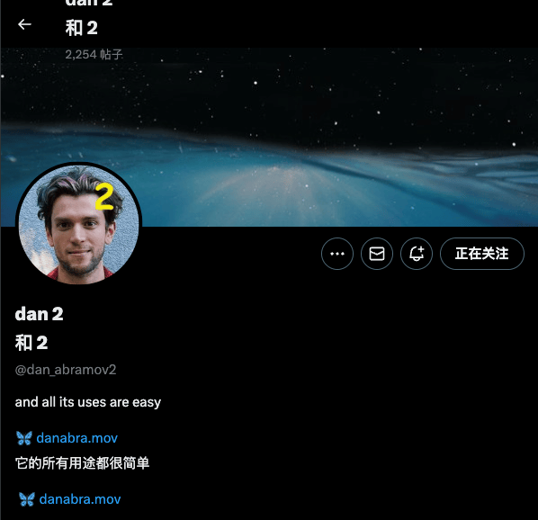
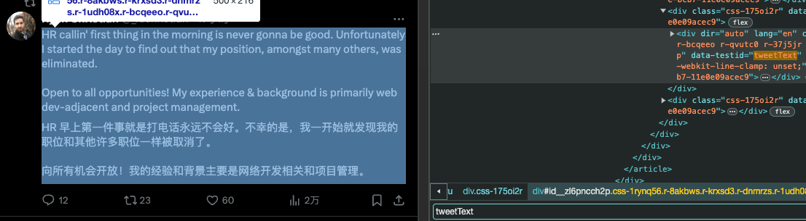
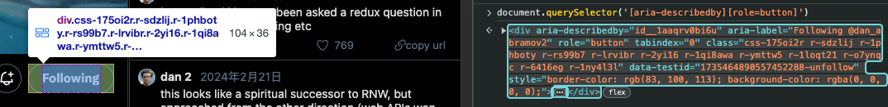

# 高級自定義選項

你可以在擴展配置頁面 -> 開發者設置 -> User Config 裡編輯更多 UI 裡無法編輯的自定義配置，適用於高級用戶，參數講解詳見最後的說明。當前內置的 `config` 可以在[這裡](https://dash.immersivetranslate.com/#developer)，點擊 `Click to expand the final config` 找到。## 用戶規則

通過 `Rules` 可以對特定的網站進行自定義配置，決定哪些內容是否需要被翻譯，或調整網頁樣式等。

```json
[
  {
    "matches": "www.google.com",
    "selectors": [".title"]
  },
  {
    "matches": "twitter.com",
    "selectors": [".text"],
    "excludeSelectors": ["nav", "footer"]
  }
]
```

使用 `matches` 來匹配對應的網站。允許通配符，如 `*.google.com`,`www.google.com/test/*`,`file://*`

使用 `selectors` 會覆蓋智能翻譯範圍，僅翻譯該選擇器匹配到的元素。

使用 `excludeSelectors` 可以排除元素，不翻譯該位置。

使用 `selectors.add` 會在默認的基礎上添加一些 selectors

使用 `selectors.remove` 會在默認的基礎上減少一些 selectors

```json
[
  {
    "matches": "www.google.com",
    "selectors.add": ["baidu.com"],
    "excludeSelectors": ["buzzing.cc"]
  }
]
```

如果希望翻譯某個區域時，將元素視為一個整體，不將其分行，可以用 `atomicBlockSelectors` 選擇器。比如 Instagram 的個人簡介。要注意的是，使用 `atomicBlockSelectors` 前需要先用 `selectors` 進行選擇。

```json
{
  "matches": "https://www.instagram.com/*",
  "selectors": [
    "div._aa_c h1",
    "li._acaz div[role=\"menuitem\"]"
  ],
  "atomicBlockSelectors": [
    "div._aa_c h1",
    "li._acaz div[role=\"menuitem\"]"
  ]
}
```

如果譯文導致頁面錯位，文字重疊等邊緣情況，可以使用 `globalStyles` 調整網頁樣式來修復。比如 youtube 的標題，用來移除原網頁的最大高度。

```json
{
  "matches": "www.google.com",
  "globalStyles": { ".title": "max-height:unset;" }
}
```

## 注入式 CSS

透過注入式 CSS 可以向全局注入自定義網頁樣式。可以搭配 `Rules` 的 `translationClasses` 一起使用。

```css
.immersive-translate-target-wrapper img { width: 16px; height: 16px }
```

也可以像常規的網頁樣式管理器那樣，對網站進行更加個性化的樣式設計。（甚至利用 `display:none` 去廣告）

```css
.title {
  color: red;
}
```## 用戶配置

通過 Config 可以自定義此插件的相關配置，如翻譯服務、特定語言語言翻譯選項等。

```json
{
  "translationService": "tencent",
  "translationServices": {
    "tencent": {
      "secretId": "xxx",
      "secretKey": "xxx",
      "matches": ["twitter.com"]
    }
  },
  "translationUrlPattern": {
    "excludeMatches": ["www.google.com"]
  },
  "translationLanguagePattern": {
    "matches": ["en"]
  },
  "translationTheme": "none",
  "translationThemePatterns": {
    "underline": {
      "matches": ["discord.com"]
    }
  },
  "sourceLanguageUrlPattern": {
    "en": {
      "matches": ["*.google.com"]
    }
  },
  "generalRule": {
    "_comment": "",
    "normalizeBody": "",
    "injectedCss": [],
    "additionalInjectedCss": [],
    "wrapperPrefix": "smart",
    "wrapperSuffix": "smart",
    "isPdf": false,
    "isTransformPreTagNewLine": false,
    "urlChangeDelay": 20,
    "isShowUserscriptPagePopup": true,
    "observeUrlChange": true,
    "paragraphMinTextCount": 8,
    "paragraphMinWordCount": 2,
    "blockMinTextCount": 32,
    "blockMinWordCount": 5,
    "containerMinTextCount": 18,
    "lineBreakMaxTextCount": 0,
    "globalAttributes": {},
    "globalStyles": {},
    "selectors": [],
    "preWhitespaceDetectedTags": ["DIV", "SPAN"],
    "stayOriginalSelectors": [],
    "additionalSelectors": [],
    "atomicBlockTags": [],
    "excludeSelectors": [],
    "additionalExcludeSelectors": [],
    "translationClasses": [],
    "atomicBlockSelectors": [],
    "excludeTags": [],
    "metaTags": ["META", "SCRIPT", "STYLE", "NOSCRIPT"],
    "additionalExcludeTags": [],
    "stayOriginalTags": ["CODE", "TT", "IMG", "SUP"],
    "additionalStayOriginalTags": [],
    "inlineTags": [],
    "additionalInlineTags": [],
    "extraInlineSelectors": [],
    "additionalInlineSelectors": [],
    "extraBlockSelectors": [],
    "allBlockTags": [],
    "pdfNewParagraphLineHeight": 2.4,
    "pdfNewParagraphIndent": 1.2,
    "pdfNewParagraphIndentRightIndentPx": 130,
    "fingerCountToToggleTranslagePageWhenTouching": 4
  },
  "rules": [
    {
      "matches": "www.google.com",
      "selectors": [".class"]
    }
  ]
}
```

其中，`rules` 裡的規則字段，可以使用 `generalRule` 裡的全部字段。`rules` 擁有最高優先級，當匹配到特定網站的某一條 `rule` 時，會合併 `generalRule` 和該 `rule` 的規則。

介紹一些 Config 常見的字段。### 允許渲染普通 HTML 標籤
去 [開發設置](https://dash.immersivetranslate.com/#developer) -> Edit Full User Config

編輯 "enableRenderHtmlTag": true

### 不在 popup 面板裡展示未配置的翻譯服務

`"showUnconfiguredTranslationServiceInPopup": false`### 翻譯服務配置

使用 `translationService` 選擇默認的翻譯引擎，當前支持：

```typescript
| "bing"
| "transmart"
| "google"
| "deepl"
| "openai"
| "gemini"
| "baidu"
| "volc"
| "youdao"
| "caiyun"
| "tencent"
| "openl"
```

使用 `translationServices` 配置各家翻譯服務的 `apikey`，不同服務商需要的參數不一樣，它們的 API 密鑰均可在各自官網的開發者中心申請。

如騰訊翻譯君，需要配置 `secretId`, `secretKey`。你可以前往騰訊雲申請 API 密鑰，每月免費字符 500 萬。具體申請過程參考[這裡](/docs/services/tencent)

```json
"translationServices": {
  "tencent": {
    "secretId": "xxx",
    "secretKey": "xxx",
    "matches":["twitter.com"],
    "limit": 3,
    "apiUrl":"",
    "maxTextGroupLengthPerRequest": 25,
    "maxTextLengthPerRequest": 1800
  }
}
```

`matches` 字段，為特定網站使用該翻譯服務。

`limit`字段，指定該翻譯服務的每秒最多請求數（有些服務會限制每秒最大請求數）。

`maxTextGroupLengthPerRequest` 字段，每次請求最大的段落數

`maxTextLengthPerRequest` 字段，每次請求最大的字符數

`apiUrl` 可以自定義翻譯接口的地址。### 總是翻譯特定網站

`translationUrlPattern` 配置總是翻譯的網站，以及永不翻譯的網站。

- `matches` 配置總是翻譯的網站，
- `excludeMatches` 配置永不翻譯的網站。

配置值可以是域名或帶有 `*` 的網址，比如：`www.google.com/mail/*`

```json
"translationUrlPattern": {
    "matches": ["stackoverflow.com"],
    "excludeMatches": ["www.google.com/mail/*"]
}
```

### 總是翻譯特定語言

translationLanguagePattern, 配置總是翻譯的語言，以及永不翻譯的語言。

- `matches` 配置總是翻譯的語言，比如 `en`,
- `excludeMatches` 配置永不翻譯的語言。### 譯文顯示格式

`translationTheme` 為譯文的顯示格式，當前支持以下樣式：

```typescript
| "none"
| "dashed"
| "dotted"
| "underline"
| "mask"
| "paper"
| "highlight"
| "blockquote"
| "weakening"
| "italic"
| "bold"
| "thinDashed";
```

對應的中文名：

```json
{
  "none": "無",
  "dashed": "虛線下劃線",
  "dotted": "點狀下劃線",
  "underline": "直線下劃線",
  "mask": "模糊效果",
  "paper": "白紙陰影效果",
  "highlight": "高亮",
  "blockquote": "引用樣式",
  "weakening": "弱化",
  "italic": "斜體",
  "bold": "加粗",
  "thinDashed": "細虛線下劃線"
}
```

`translationThemePatterns` 可以為不同網站配置不同的譯文樣式。

```json
"translationThemePatterns": {
  "underline": {
    "matches": ["discord.com"]
  }
}
```

### 類 gpt 頁面流消息翻譯

```json
{
  "matches": ["chat.openai.com"], //類 gpt 網址
  "excludeSelectors": [".markdown *"],
  "aiRule": {
    "streamingSelector": ".result-streaming.markdown",
    "messageWrapperSelector": ".markdown",
    "streamingChange": true
  }
}
```### 規則

`rules` 為數組對象，可以配置針對特別網站的規則，比如讓推特只翻譯某一部分區域:

```json
{
  "rules": [
    {
      "id": "twitter",
      "matches": ["twitter.com", "mobile.twitter.com", "tweetdeck.twitter.com"],
      "selectors": [
        "[data-testid='tweetText']",
        ".tweet-text",
        ".js-quoted-tweet-text",
        "[data-testid='card.layoutSmall.detail'] > div:nth-child(2)",
        "[data-testid='developerBuiltCardContainer'] > div:nth-child(2)",
        "[data-testid='card.layoutLarge.detail'] > div:nth-child(2)"
      ],
      "extraInlineSelectors": ["[data-testid=\"tweetText\"] div"]
    }
  ]
}
```

當前內置的 `rules` 可以在[這裡](https://github.com/immersive-translate/next-immersive-translate/blob/main/docs/buildin_config.json) 找到。

以下挑選部分重要字段進行說明：

```typescript
export interface Rule {
  // 匹配網站
  id?: string; //系統每個適配的規則都有自己的id,如果用戶想要複用這條規則在此基礎之上變動的話，需要在自己的規則上加上這個相應的id就可以複用了
  matches?: string | string[]; // 該條Rule將僅匹配此處的網站。
  excludeMatches?: string | string[]; // 排除特定的網站。
  selectorMatches?: string | string[]; // 用選擇器來匹配，而無需指定所有url
  excludeSelectorMatches?: string | string[]; // 排除規則，同上。

  // 指定翻譯範圍
  selectors?: string | string[]; // 僅翻譯匹配到的元素
  excludeSelectors?: string | string[]; // 排除元素，不翻譯匹配的元素
  excludeTags?: string | string[]; // 排除Tags，不翻譯匹配的Tag

  // 追加翻譯範圍，而不是覆蓋
  additionalSelectors?: string | string[]; // 追加翻譯範圍。在智能翻譯的區域，追加翻譯位置。
  additionalExcludeSelectors?: string | string[]; // 追加排除元素，讓智能翻譯不翻譯特定位置。
  additionalExcludeTags?: string | string[]; // 追加排除Tags

  // 保持原樣
  stayOriginalSelectors?: string | string[]; // 匹配的元素將保持原樣。常用於論壇網站的標籤。
  stayOriginalTags?: string | string[]; // 匹配到的Tag將保持原樣，比如 `code`

  // 區域翻譯
  atomicBlockSelectors?: string | string[]; // 區域選擇器, 匹配的元素將被視為一個整體, 不會分段翻譯
}
```markdown
  atomicBlockTags?: string | string[]; // 區域Tag選擇器,  同上

  // Block or Inline
  extraBlockSelectors?: string | string[]; // 額外的選擇器，匹配的元素將作為 block 元素，獨佔一行。
  extraInlineSelectors?: string | string[]; // 額外的選擇器，匹配的元素將作為 inline 元素。

  inlineTags?: string | string[]; // 匹配的 Tag 將作為 inline 元素
  preWhitespaceDetectedTags?: string | string[]; // 匹配的 Tag 將自動換行

  // 譯文樣式
  translationClasses?: string | string | string[]; // 為譯文添加額外的 Class

  // 全局樣式
  globalStyles?: Record<string, string>; // 修改頁面樣式，若譯文導致頁面錯亂，這個很有用。
  globalAttributes?: Record<string, Record<string, string>>; // 修改頁面元素的屬性

  // 嵌入樣式
  injectedCss?: string | string[]; // 嵌入CSS樣式
  additionalInjectedCss?: string | string[]; // 追加CSS樣式，而不是直接覆蓋。

  // 上下文
  wrapperPrefix?: string; // 譯文區域的前綴，默認為 smart，根據字數決定是否換行。
  wrapperSuffix?: string; // 譯文區域的後綴

  // 譯文換行字數
  blockMinTextCount?: number; // 將譯文作為 block 的最小字符數，否則譯文為 inline 元素。
  blockMinWordCount?: number; // 同上。如果希望它們始終換行, 可以都填0.

  // 內容可翻譯的最小字數
  containerMinTextCount?: number; // 智能識別時，元素最少包含的字符數，才會被翻譯，默認為18
  paragraphMinTextCount?: number; // 原文段落的最小字符數, 大於數字的內容將被翻譯
  paragraphMinWordCount?: number; // 原文段落的最小單詞數

  // 長段落強制換行字數
  lineBreakMaxTextCount?: number; // 開啟翻譯長段落時，強制進行分行的段落最大字符數。

  // 啟動翻譯的時機
  urlChangeDelay?: number; // 進入頁面後，延遲多少毫秒開始翻譯。為了等網頁的初始化，目前默認為250ms
  observeUrlChange?: boolean; // 檢測url地址發生變化時，再次啟動翻譯，默認為true。

  // 移動端
  isShowUserscriptPagePopup?: boolean; // 在移動設備上展示頁面內的浮窗, 默認為true.
  fingerCountToToggleTranslagePageWhenTouching?: number; // 四指觸摸則翻譯，可以設置為 0，2，3，4，5

  // AI streaming 翻譯
  aiRule: {
    streamingSelector: string; //gpt 網頁中標記正在翻譯元素的選擇器
    messageWrapperSelector: string; // 消息正文選擇器
    streamingChange: boolean; //類 gpt 網頁反復的消息是增量更新還是全量更新。gpt 是增量
  };
}
```

## 高級自定義選項實戰

### 實用小技巧

這部分會介紹一些即插即用的保姆級配置。

將這些配置一鍵複製，打開[開發者設置](https://dash.immersivetranslate.com/#developer)，展開 `Edit Full User Config` ，複製到最後一項即可，注意不要忘記給前一項加上逗號，以及最後一項不能加逗號

#### 不能用的翻譯服務太多了，如何在插件面板裡只展示能用的翻譯服務

```json
  "showUnconfiguredTranslationServiceInPopup": false
```#### 如何讓不同的站點默認選擇不同的翻譯服務？例如有的網站我想要好一點但要花錢的翻譯效果，有的網站我只需要免費能看的翻譯就行了

注意看，眼前這個配置叫翻譯服務，他配置了谷歌翻譯，讓有關推特的相關站點的翻譯都使用他去翻譯，因為 `google` 翻譯是免費的，推特是衝浪的，只要能看懂就行了。

仔細看，他還配置了 `deepl` 的翻譯服務，他讓 `deepl` 專門去翻譯 `scihub` 這種容錯率低的需要高精確的學術網站

```json
  "translationServices": {
    "google": {
      "matches":["https://twitter.com"]
    },
    "deepl": {
      "matches":["https://www.sci-hub.se"]
    }
  }
```

> ⚠️ 請注意，若您希望翻譯屬於同一域名的所有網站，簡單使用 *.twitter.com 或 https://twitter.com/ 是無效的。正確的做法應參照上文所示。這是因為 *.twitter.com 僅能匹配子域名如 xxx.twitter.com，而不包括頂級域名本身。### 網站適配案例

這部分會介紹一些插件自己對常見的網站的 `rules`，通過實際例子來理解高級自定義選項。同時為了簡潔，這裡只會介紹最常用的字段，比如 `selectors` , `excludeSelectors` 等等，如果你對這部分內容感興趣的話，歡迎聯繫我們，我們會繼續更新相關的內容。

在介紹之前，一個非常關鍵的東西就是沉浸式翻譯插件的工作原理，同時也是一個插件的工作原理。在此之前，需要有一定的 `HTML` 、`CSS` 、 `JavaScript` 基礎，相關基礎可以在 `MDN` 網站上學習。Okay，話不多說，讓我們走進沉浸式翻譯的內部一探究竟。插件的工作機制簡單來說，就是向網頁中注入第三方腳本，這個腳本可以對網頁結構，樣式，甚至行為進行相當自由地魔改。

我們的沉浸式翻譯插件也不例外，讓我們來簡單分析一下沉浸式翻譯它幹了個什麼事

- 獲取需要翻譯的元素集合
- 翻譯元素集合中的文本
- 將翻譯的結果插入到元素集合中

Okay，但是再仔細想想，自然而然就會帶出接下來兩個問題

- 我們還需要確定哪些元素需要被翻譯，如果全盤翻譯，往往會破壞用戶的沉浸式體驗，像一些簡單明瞭的按鈕，或者導航欄。
- 將翻譯的結果插入到元素集合中也會帶來一個新的挑戰，如何保證插入的結果與原生網頁保持一致，不去影響原生網頁的樣式。

我們的 `Rules` 的核心就是解決上述兩個問題。因為作為插件，沉浸式翻譯面對的是市面上所有的網頁，加起來可能超過幾十萬，甚至幾百萬的網頁，這些網頁的頁面結構，使用的技術也是相差殆盡。因為網頁的不同，導致了一個通用的邏輯是幾乎不可能的，很難找到一套通用的邏輯，能夠去適配所有的網站內容。這樣看來，解決方法似乎只有挨著挨著對每個網站進行單獨的適配。接著為了更方便地適配，我們又利用了配置即代碼的思想，將適配的工作轉換成了配置字段的工作。這樣的另一個好處就是，用戶也可以參與到適配工作起來。

同時，在進行配置的時候，最好不要直接使用下面幾個字段，這樣會導致覆蓋掉原先的配置項，而是採用 `selector.add` `excludeSelector.add` 這幾個字段以繼承的方式，在原先的配置項的基礎上進行修改

下面，我們將會介紹沉浸式翻譯對站點的適配工作

下面是推特的 Rules，為了簡潔，我們將關注其中的幾個關鍵字段，剩餘字段可以結合上文中的 `Rules` 理解

```json
[
  {
    "id": "twitter",
    "matches": [
      "twitter.com",
      "mobile.twitter.com",
      "tweetdeck.twitter.com",
```
```json
{
  "pro.twitter.com",
  "https://platform.twitter.com/embed*"
],
"selectors": [
  // 指定翻譯的元素，只會翻譯選擇器匹配到的元素
  "[data-testid=\"tweetText\"]",
  ".tweet-text",
  ".js-quoted-tweet-text",
  "[data-testid='card.layoutSmall.detail'] > div:nth-child(2)",
  "[data-testid='developerBuiltCardContainer'] > div:nth-child(2)",
  "[data-testid='card.layoutLarge.detail'] > div:nth-child(2)",
  "[data-testid='cellInnerDiv'] div[data-testid='UserCell'] > div> div:nth-child(2)",
  "[data-testid='UserDescription']",
  "[data-testid='HoverCard'] div[dir=auto]",
  "[data-testid='HoverCard'] span[dir=auto]",
  "[data-testid='HoverCard'] [role='dialog'] div[dir=ltr]",
  "[data-testid='birdwatch-pivot'] div[dir=ltr]"
],
"excludeSelectors": [
  // 不會翻譯的被CSS選擇器選中的元素
  "[aria-describedby][role=button]",
  "header",
  "[data-testid='radioGroupplayback_rate'] div",
  "[data-testid='userFollowIndicator']",
  "[class='css-901oao r-14j79pv r-37j5jr r-n6v787 r-16dba41 r-1cwl3u0 r-bcqeeo r-qvutc0']",
  "[class='css-175oi2r r-1wbh5a2 r-dnmrzs']"
],
"globalStyles": {
  // 全球樣式，強制覆蓋掉原樣式
  "[data-testid='card.layoutLarge.detail'] > div:nth-child(2)": "-webkit-line-clamp: unset;",
  "[data-testid='card.layoutSmall.detail'] > div:nth-child(2)": "-webkit-line-clamp: unset;",
  "[data-testid='tweetText']": "-webkit-line-clamp: unset;"
}
}
```
```
- `selector`: 指定翻譯的元素集合

  為什麼需要這個字段

  - 因為不是所有元素都有文字且需要翻譯的，提供這樣一個字段既可以保證性能又可以保證用戶的沉浸式體驗

  舉個例子

  - 在推特中，如果我們不指定 selector，那麼他將會將頁面中的所有識別為英文的文字都進行翻譯一遍，如下圖，用戶的昵稱往往是不需要翻譯的。

  

  字段含義

  - ```
      "selectors": [ // 會被翻譯的CSS選擇器集合
      "[data-testid=\"tweetText\"]",
    ]
    ```

  這裡數組的每一項都是一個 CSS 選擇器，用來選擇頁面中的需要翻譯的元素，這裡我們以第一個選擇器為例，如下圖所示，第一個選擇器命中的是所有推文的元素

  

- `excludeSelectors`: 不會被翻譯的元素集合

  為什麼需要這個字段

  - 因為一個僅翻譯的選擇器是不夠的，可能會出現，匹配中的元素卻不需要翻譯的，即兩者可能存在重合的部分，因此需要再設置一個字段來排除掉不需要翻譯的元素
  - 由於頁面結構是非常複雜的，提供這樣兩個配置項，讓配置更加靈活
  - 相關的優先級是：對於同等選擇器，selectors > excludeSelectors，剩下的依靠 CSS 優先級來比較

  字段含義

  - ```
      "excludeSelectors": [ // 不會翻譯的被CSS選擇器選中的元素
      "[aria-describedby][role=button]",
    ],
    ```

  還是看第一個，這裡我們排除掉了關注按鈕的這個翻譯
  

- `globalStyles`： 添加全局樣式，強制覆蓋掉原先的樣式

  為什麼需要這個字段

  - 在某些情況下，因為原先網頁的相關 CSS 樣式，會導致整個的翻譯展示效果不是很好，出現被截斷，不換行等等效果
  - 通過這個字段，提供一種暴力的解決方案，直接修改原生網頁的 CSS 屬性來解決

  字段含義

  - ```
        "globalStyles": {
      // 全局樣式，強制覆蓋掉原樣式
      "[data-testid='card.layoutLarge.detail'] > div:nth-child(2)": "-webkit-line-clamp: unset;",
      "[data-testid='card.layoutSmall.detail'] > div:nth-child(2)": "-webkit-line-clamp: unset;",
      "[data-testid='tweetText']": "-webkit-line-clamp: unset;"
    }
    ```

  `-webkit-line-clamp` 這個屬性用來控制顯示的行數，多餘的行會被截斷，這裡設置成 `unset` ，可以保證譯文不會被這個屬性所截斷
```### 自訂網站適配

關於適配規則，當然你也可以自定義規則，進入到插件選項頁面，點擊[開發者設置](https://dash.immersivetranslate.com/#developer)，展開 `Edit User Rules` ，在這裡進行各個網站的自定義適配。下面結合實際規則進行講解

```
[
  {
    "selectors.remove": [
      "[data-testid=\"tweetText\"]"
    ],
    "selectors.add": [
      ""
    ],
    "excludeSelectors.add":[
      ""
    ],
    "excludeSelectors.remove":[
      ""
    ],
    "id": "twitter"
  }
]
```

這個規則會讓推特頁面的推文不進行翻譯。下面詳細介紹字段的含義

`id` 是沉浸式翻譯目前已經定義好的相關網站的集合，每個 `id` 都對應相關的站點。`id` 的好處有兩個

- 使用 `id` 能繼承沉浸式翻譯之前的適配規則，用戶可以在這基礎上進行增刪
- 使用 `id` 就不用寫繁瑣的匹配字段了

下面介紹一些沉浸式翻譯內置服務的常見的 `id`

- `"isEbook"` epub 閱讀器頁面的配置
- `"isEbookBuilder"` 生成 epub 雙語書頁面的配置
- `"pdf"` pdf 雙語對照翻譯頁面的配置

完整的 `id` 集合可以在[開發者設置](https://dash.immersivetranslate.com/#developer)中，`Click to expand the final config` 中找到

`selectors` 負責指定需要翻譯的CSS選擇器，建議使用子項 `.add` `.remove` 在原先的基礎上進行增刪

`excludeSelectors` 負責排除不需要翻譯的CSS選擇器，建議使用子項 `.add` `.remove` 在原先的基礎上進行增刪

**更多講解**

Block 和 inline 的區別，如果想了解更多可以看[這裡](https://developer.mozilla.org/en-US/docs/Web/HTML/Inline_elements#inline)

- block 元素會獨佔一行，多個相鄰的 block 元素會各自新起一行.
- inline 元素不會獨佔一行，多個相鄰的 inline 元素會排列在同一行裡,直到一行排列不下才會新換一行。